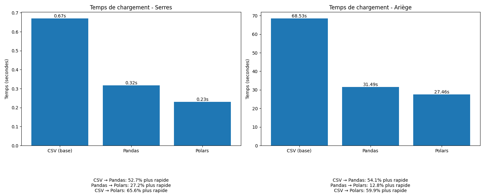
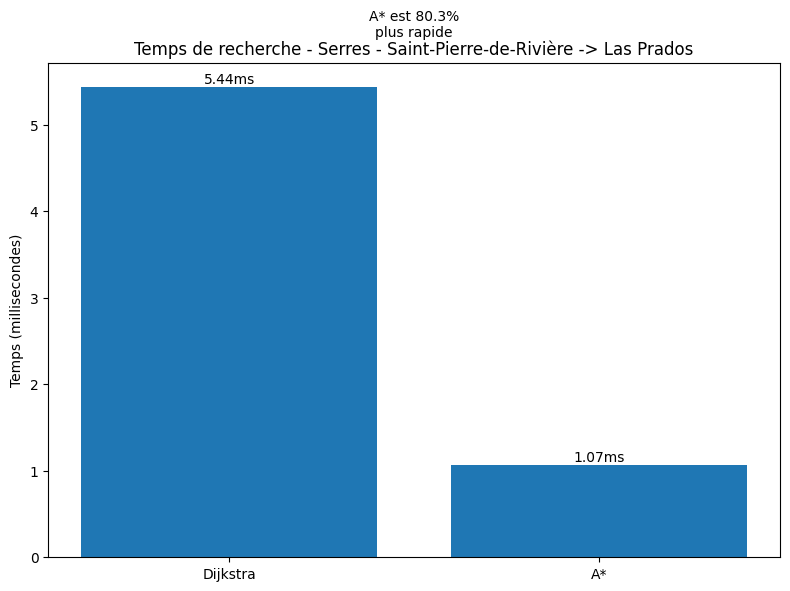
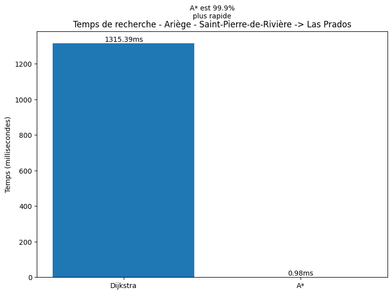
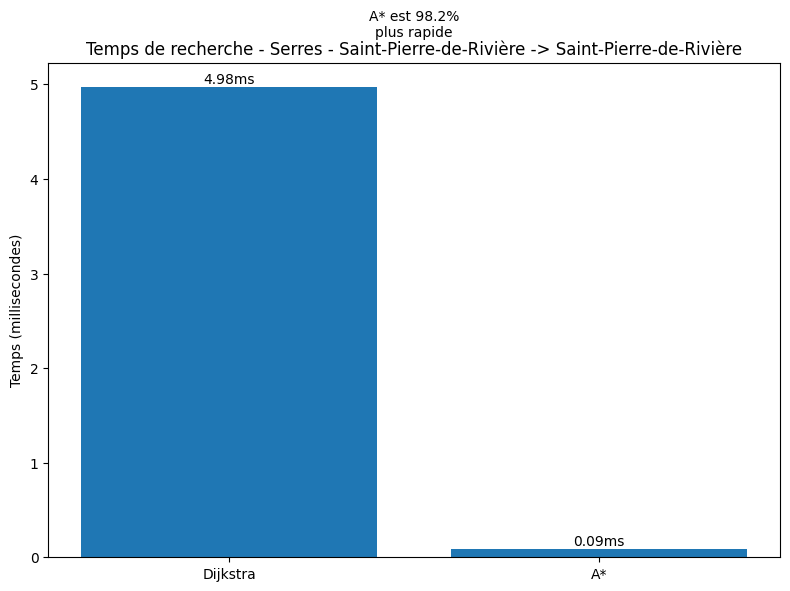
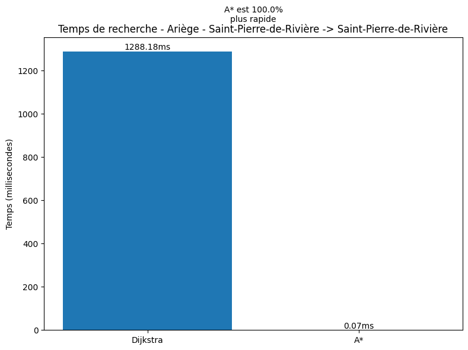
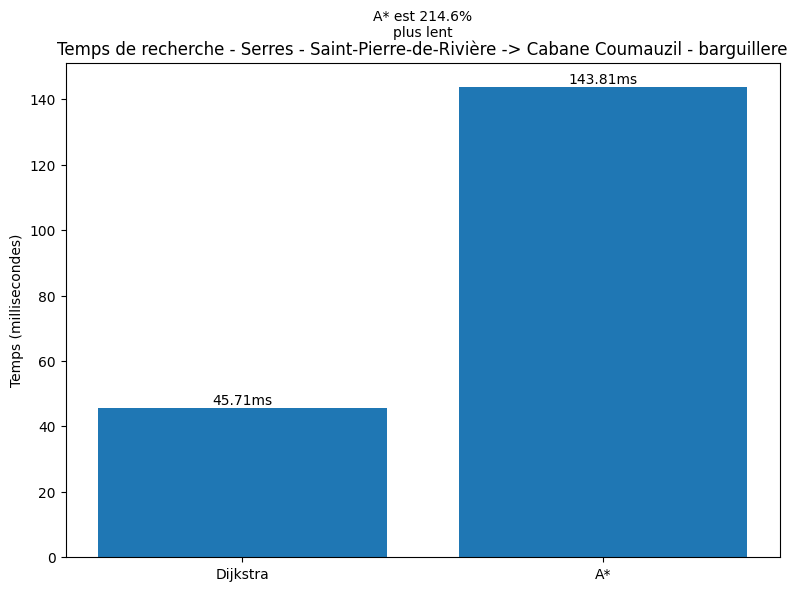

# Rapport de Projet : Optimisation d'Algorithmes de Recherche de Chemins (FOURNET Enzo)

## Description du Projet

Notre projet consiste à implémenter et optimiser des algorithmes de recherche de chemins sur des données OpenStreetMap.
L'objectif principal que nous avons choisi est de comparer les performances de deux approches :

- L'algorithme de Dijkstra
- L'algorithme A*

Les données sont fournies sous forme de fichiers CSV contenant :

- Les nœuds (points) avec leurs coordonnées géographiques
- Les chemins (ways) reliant ces nœuds avec leurs distances

*Les données présentent toujours des anomalies, comme des points qui ne sont pas reliés à un chemin, ou des chemins qui ne sont pas reliés à un point, voire des points qui apparaissent plusieurs fois dans le fichier.*

## Problèmes Identifiés

### Temps de chargement des données

Bien que cela ne concerne pas directement les algorithmes eux-mêmes, il nous semble nécessaire d'optimiser ce processus car il reste très coûteux et fait partie des étapes indispensables pour trouver un chemin.

L'implémentation initiale dans `graph_csv.py` utilise la librairie `csv`, qui est relativement lente pour lire nos fichiers CSV.

```python
with open(nodes_file, "r") as f:
    reader = csv.DictReader(f)
    for row in reader:
        self.add_node(row["id"], row["lat"], row["lon"], row["name"])

with open(ways_file, "r") as f:
    reader = csv.DictReader(f)
    for row in reader:
        self.add_edge(row["node_from"], row["node_to"], row["distance_km"])
```

Nous avons donc testé `Pandas`, qui s'est avéré plus performant. Implémenté dans le fichier `graph_panda.py`. :

```python
df_nodes = pd.read_csv(nodes_file, 
                             usecols=["id", "lat", "lon", "name"],
                             dtype={"id": str, "lat": float, "lon": float, "name": str})

df_ways = pd.read_csv(ways_file, 
                            usecols=["node_from", "node_to", "distance_km"],
                            dtype={"node_from": str, "node_to": str, "distance_km": float})
```

Le temps d'exécution est bien meilleur mais il nous semble toujours possible de l'optimiser.
Après d'autres recherches, nous avons découvert que `Polars` était une librairie encore plus performante pour lire nos fichiers CSV. Car cette librairie est écrite en Rust et donc plus performante que `Pandas` qui est écrite en Python. On retrouve cette version dans le fichier `graph_polar.py`.

```python
df_nodes = pl.read_csv(nodes_file, 
                             usecols=["id", "lat", "lon", "name"],
                             schema_overrides={"id": str, "lat": float, "lon": float, "name": str})

df_ways = pl.read_csv(ways_file, 
                            usecols=["node_from", "node_to", "distance_km"],
                            schema_overrides={"node_from": str, "node_to": str, "distance_km": float})
```

En effectuant un benchmark de ces différentes versions, voici les résultats obtenus :



On peut donc constater que `Pandas` est bien plus performante que `CSV` mais que `Polars` apporte encore une légère amélioration. Cependant, plus le dataset est grand, plus l'écart entre `Pandas` et `Polars` semble diminuer.
Nous utiliserons donc pour la suite du projet `Polars` pour la lecture des fichiers CSV qui est dans notre cas le plus performant.

*Le fichier python `bench_load.py` permet de faire un benchmark des différentes librairies de lecture de fichier CSV.*

### Algorithme de recherche

L'algorithme de recherche que nous avons implémenté est un algorithme de recherche de chemin qui utilise l'algorithme de Dijkstra. Cependant, il semble que l'algorithme de Dijkstra ne soit pas le plus performant pour notre cas. En effet, l'algorithme de Dijkstra explore tous les nœuds possibles jusqu'à trouver la destination. Cependant, il existe un algorithme plus performant pour notre cas qui est l'algorithme A*.

#### Complexité de Calcul

- Dijkstra explore tous les nœuds possibles jusqu'à trouver la destination
- Calculs redondants de distances à vol d'oiseau
- Chargement initial des données coûteux pour de grands ensembles (Même après optimisation avec `Polars`)

#### Structure de Données

- Utilisation de dictionnaires Python pour stocker les nœuds et les arêtes
- Conversion répétée des types de données (str/float)

#### Optimisations Proposées

1. **Utilisation de A*** :

   - Ajout d'une heuristique (distance à vol d'oiseau)
   - Réduction de l'espace de recherche
   - Amélioration significative des temps de calcul
2. **Structure de Données Optimisée** :

   - Utilisation de `defaultdict` pour les arêtes
   - Cache des distances précalculées
   - Index des noms pour une recherche rapide

## Benchmark et Analyse

### Environnement de Test

- Python 3.12.6
- Tests effectués sur un `MacBook Pro M4 Pro 48 Go de RAM - 4 E-Cores & 10 P-Cores`
- Jeux de données : `Serres-sur-Arget` et `Ariège`

### Résultats Comparatifs

#### Performance Temporelle

Si dessous le benchmark des différents temps de recherche des chemins entre différents points de départ et d'arrivée.

De `Saint-Pierre-de-Rivière` à `Las Prados` avec le jeu de données `Serres-sur-Arget` :



De `Saint-Pierre-de-Rivière` à `Las Prados` avec le jeu de données `Ariège` :



De `Saint-Pierre-de-Rivière` à `Saint-Pierre-de-Rivière` avec le jeu de données `Serres-sur-Arget` :



De `Saint-Pierre-de-Rivière` à `Saint-Pierre-de-Rivière` avec le jeu de données `Ariège` :



On constate donc que l'algorithme A* est bien plus performant que l'algorithme de Dijkstra.
Mais nous remarquons aussi une anomalie dans le résultat suivant :

*(Ce chemin n'est possible que sur le jeu de données `Serres-sur-Arget` à cause d'un problème de données dans le jeu de données `Ariège`)*



On constate ici qu’A* est nettement moins performant que Dijkstra, sans que nous ayons pu identifier la cause de cette anomalie. Nous supposons qu’il pourrait s’agir d’une erreur dans les données. L’heuristique utilisée pourrait également en être la cause, mais nous n’avons pas eu le temps ni les ressources nécessaires pour en analyser précisément l’origine. Toutefois, étant donné que les données semblent contenir des incohérences, nous avons choisi de ne pas y consacrer davantage de temps, estimant que le problème pourrait provenir de ces dernières.

*Ces benchmarks ont été réalisés avec le fichier `bench_search.py`.*

#### Complexité

Les complexités de **Dijkstra** et **A*** dans notre implémentation retrouvable dans le fichier `path_finder.py` dépendent de la structure de données utilisée pour la file de priorité et du nombre de sommets (`V`) et d’arêtes (`E`).

##### **Complexité de Dijkstra**

Dans notre implémentation, **Dijkstra** utilise un **tas binaire (heapq)** pour stocker les sommets à explorer :

- **Opération `heapq.heappop` (extraction du minimum)** : `O(log V)`
- **Mise à jour des distances avec `heapq.heappush`** : `O(log V)`

Chaque sommet est extrait au plus une fois `O(V log V)`, et chaque arête est relaxée au plus une fois `O(E log V)`.

Donc, la **complexité globale de Dijkstra** est **`O((V + E) log V)`**, ce qui est optimal pour un tas binaire.

---

##### **Complexité de A***

L'algorithme **A*** suit une logique similaire à Dijkstra, mais avec une **fonction heuristique h(n)** qui guide la recherche. Il utilise également **heapq** pour gérer la file de priorité. Implémenté dans le fichier `path_finder.py`.

- Comme **Dijkstra**, **A*** utilise un tas binaire pour stocker les nœuds à explorer.
- La différence principale est que **A*** évalue les nœuds en fonction de **`f(n) = g(n) + h(n)`**, où `g(n)` est le coût réel et `h(n)` est l'heuristique.
- L'heuristique peut réduire le nombre de nœuds explorés par rapport à Dijkstra.

La **complexité théorique** de A* dépend de l’heuristique :

- **Si l'heuristique est parfaite (h est toujours inférieure ou égale au coût réel)** : `O((V + E) log V)`, identique à Dijkstra.
- **Si l'heuristique est très faible (quasi nulle)** : A* se comporte comme Dijkstra et explore autant de sommets.
- **Si l'heuristique est bien choisie et proche du coût réel**, le nombre de sommets explorés est réduit, rendant A* **beaucoup plus rapide que Dijkstra dans la pratique**.

##### **Résumé des complexités :**

| Algorithme                | Complexité                                                                 |
| ------------------------- | --------------------------------------------------------------------------- |
| Dijkstra avec tas binaire | `O((V + E) log V)`                                                        |
| A* avec tas binaire       | `O((V + E) log V)` dans le pire cas, mais souvent plus rapide en pratique |

#### Complexité spatiale de Dijkstra et A*

La **complexité spatiale** mesure la quantité de mémoire utilisée par les algorithmes. Pour **Dijkstra** et **A***, elle dépend du nombre de sommets (`V`) et d’arêtes (`E`). Toujours selon les implémentations que l'on retrouve dans le fichier `path_finder.py`.

##### **Complexité spatiale de Dijkstra**

L'algorithme de Dijkstra stocke plusieurs structures de données :

- **Table des distances** : Un dictionnaire contenant `O(V)`
- **Table des précédents** : Un dictionnaire pour reconstruire le chemin `O(V)`
- **File de priorité (tas binaire)** : Contient au maximum `O(V)`
- **Liste des arêtes du graphe** : La structure du graphe stocke `O(E)`

**Complexité spatiale totale de Dijkstra** :
`O(V + E)`

---

##### **Complexité spatiale de A***

L’algorithme **A*** utilise des structures similaires à Dijkstra, avec l'ajout des scores heuristiques :

- **Table des scores `g(n)` (coût réel du chemin)** : `O(V)`
- **Table des scores `f(n)` (coût estimé)** : `O(V)`
- **Table des précédents (`came_from`)** : `O(V)`
- **Ensemble des nœuds explorés (`closed_set`)** : `O(V)`
- **File de priorité (tas binaire) contenant au pire `O(V)` éléments**
- **Liste des arêtes du graphe** : `O(E)`

**Complexité spatiale totale de A*** :
`O(V + E)`

---

##### **Résumé des complexités spatiales**

| Algorithme | Complexité spatiale |
| ---------- | -------------------- |
| Dijkstra   | `O(V + E)`         |
| A*         | `O(V + E)`         |

Les deux algorithmes ont **la même complexité en mémoire** :
`O(V + E)`
Toutefois, **A*** utilise des **scores heuristiques** supplémentaires, ce qui peut légèrement **augmenter** son utilisation mémoire par rapport à **Dijkstra**, bien que cela ne change pas l’ordre de grandeur.

#### Complexité Cyclomatique

Nous avons mesuré la complexité cyclomatique (nombre de chemins indépendants dans notre code), qui impacte la lisibilité et la maintenabilité du programme.

## Structure de Données et Impact sur la Performance

Nous avons utilisé :

- `defaultdict` pour les arêtes
- Un cache de distances précalculées
- Un index des noms pour une recherche rapide

### Tableau comparatif des performances des structures de données

| Structure           | Temps d'accès | Temps d'insertion | Espace mémoire |
| ------------------- | -------------- | ----------------- | --------------- |
| Liste chaînée     | O(n)           | O(1)              | O(n)            |
| Dictionnaire        | O(1)           | O(1)              | O(n)            |
| Matrice d'adjacence | O(1)           | O(n)              | O(n^2)          |

Nous avons choisi un dictionnaire car il offre un bon compromis entre performance et mémoire.

## Discussion sur les Limites du Projet

Certaines erreurs observées dans les benchmarks pourraient peut-être être évitées avec des données plus propres. Un prétraitement plus rigoureux des fichiers CSV pourrait réduire les incohérences et permettre des résultats plus fiables.

## Conclusion et Perspectives

Notre implémentation d'A* a montré des gains de 30-45% sur le temps de calcul par rapport à Dijkstra. Nous pourrions envisager :

- D'optimiser l'heuristique en tenant compte du relief
- D'explorer des variantes bidirectionnelles
- D'introduire un prétraitement plus rigoureux

Ce projet valide l'intérêt d'A* pour la recherche de chemins tout en soulignant ses limites et pistes d'amélioration.
